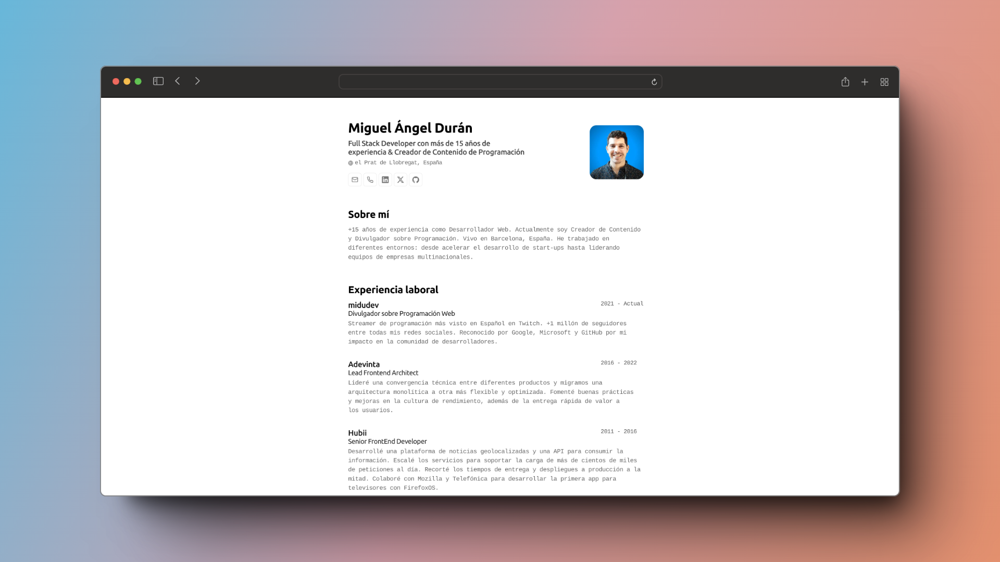

<div align="center">
 
<h2>
    <em>Minimalist Resume/CV Layout for Web and PDF</em>
</h2>
<p>
JSON CV schema from <a href="https://jsonresume.org/schema/">jsonresume.org</a>
</p>


<p>
Based on design by <a href="https://github.com/BartoszJarocki/cv">Bartosz Jarocki</a>

</p>

</div>

<div align="center">
    <a href="#-getting-started">
        Getting Started
    </a>
    <span>&nbsp;✦&nbsp;</span>
    <a href="#-commands">
        Commands
    </a>
    <span>&nbsp;✦&nbsp;</span>
    <a href="#-license">
        License
    </a>
    <span>&nbsp;✦&nbsp;</span>
    <a href="https://midu.dev">
        Personal
    </a>
   
</div>

<p></p>

<div align="center">


</div>

</img>

## 🛠️ Tech Stack

- [**Astro**](https://astro.build/) - The modern web framework
- [**Typescript**](https://www.typescriptlang.org/) - Type syntax for JavaScript
- [**Ninja Keys**](https://github.com/ssleptsov/ninja-keys) - Pure JavaScript keyboard shortcut dropdown

## 🚀 Getting Started

### 1. Use this [repo](https://github.com/midudev/minimalist-portfolio-json) as an Astro project template


- I use [pnpm](https://pnpm.io/installation) as package manager

```bash
# Enable pnpm on MacOS, WSL & Linux:
corepack enable
corepack prepare pnpm@latest --activate

# Initialize project
pnpm create astro@latest -- --template midudev/minimalist-portfolio-json
```

### 2. Add your content:
Edit the `cv.json` file to create your printable Portfolio/CV
### 3. Start dev server:

```bash
# See the result
pnpm dev
```


1. Open [**http://localhost:4321**](http://localhost:4321/) in your browser to view 🚀


## 🧞 Commands

|     | Command          | Action                                        |
| :-- | :--------------- | :-------------------------------------------- |
| ⚙️  | `dev` or `start` | Starts local dev server at `localhost:4321`  |
| ⚙️  | `build`          | Builds production bundle to `./dist/`        |
| ⚙️  | `preview`        | Local preview of production build            |


## 🔑 License

[MIT](LICENSE.txt) - Created by [**midudev**](https://midu.dev).
